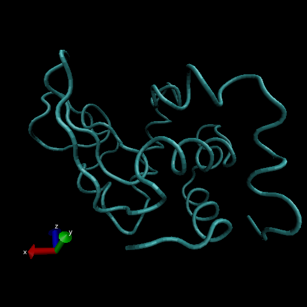

# Comparative analysis of protein structures

Using the bio3d package

```{r}
library(bio3d)

pdb <- read.pdb("1hel")
pdb
```

Let's use a bioinformatics method called NMA (Normal Mode Analysis) to predict the dynamics (flexibility) of this enzyme.

```{r}
modes <- nma(pdb)
plot(modes)
```

Make a "move" of its predicted motion. We often call this a "trajectory". 

```{r}
mktrj(modes, file="nma.pdb")
```



# 3. Introduction to Bio3D in R

```{r}
library(bio3d)
pdb <- read.pdb("1hsg")
pdb
```

> Q7: How many amino acid residues are there in this pdb object?

There are 198 amino acid residues. 

> Q8: Name one of the two non-protein residues?

One of the 2 non-protein residues are MK1.

> Q9: How many protein chains are in this structure?

There are 2 protein chains in this structure.

```{r}
attributes(pdb)
head(pdb$atom)
```


# Comparative Structure Analysis of ADK 

> Q10. Which of the packages above is found only on BioConductor and not CRAN?

The package "msa" is only found on BioConductor and not CRAN.

> Q11. Which of the above packages is not found on BioConductor or CRAN?

None of them. Each package is either found on BioConductor or CRAN. 

> Q12. True or False? Functions from the devtools package can be used to install packages from GitHub and BitBucket?

True.

```{r}
aa <- get.seq("1ake_A")
aa
```

> Q13. How many amino acids are in this sequence, i.e. how long is this sequence?

There are 214 amino acids.

```{r}
# Run BLAST
blast <- blast.pdb(aa)
```

```{r}
# Plot a summary
hits <- plot(blast)
```

```{r}
# List out some 'top hits'
hits$pdb.id
```

```{r}
# Download related PDB files
files <- get.pdb(hits$pdb.id, path="pdbs", split=TRUE, gzip=TRUE)
```

Multiple structure alignment 
```{r}
# Align related PDBs
pdbs <- pdbaln(files, fit=TRUE)
pdbs
```

```{r}
# Vector containing PDB codes for figure axis
ids <- basename.pdb(pdbs$id)

# Draw schematic alignment
plot(pdbs, labels=ids)
```

# PCA
We will use the bio3d pca() function which is designed for protein structure data.
```{r}
# Perform PCA
pc.xray <- pca(pdbs)
plot(pc.xray)
```
```{r}
# Calculate RMSD
rd <- rmsd(pdbs)

# Structure-based clustering
hc.rd <- hclust(dist(rd))
grps.rd <- cutree(hc.rd, k=3)

plot(pc.xray, 1:2, col="grey50", bg=grps.rd, pch=21, cex=1)
```

Make a trajectory visualization of the motion captured by the first Principal Component Analysis.
```{r}
# Visualize first principal component
pc1 <- mktrj(pc.xray, pc=1, file="pc_1.pdb")
```

```{r}
#Plotting results with ggplot2
library(ggplot2)
library(ggrepel)

df <- data.frame(PC1=pc.xray$z[,1], 
                 PC2=pc.xray$z[,2], 
                 col=as.factor(grps.rd),
                 ids=ids)

p <- ggplot(df) + 
  aes(PC1, PC2, col=col, label=ids) +
  geom_point(size=2) +
  geom_text_repel(max.overlaps = 20) +
  theme(legend.position = "none")
p
```

# Normal Mode Analysis

```{r}
# NMA of all structures
modes <- nma(pdbs)

plot(modes, pdbs, col=grps.rd)
```


