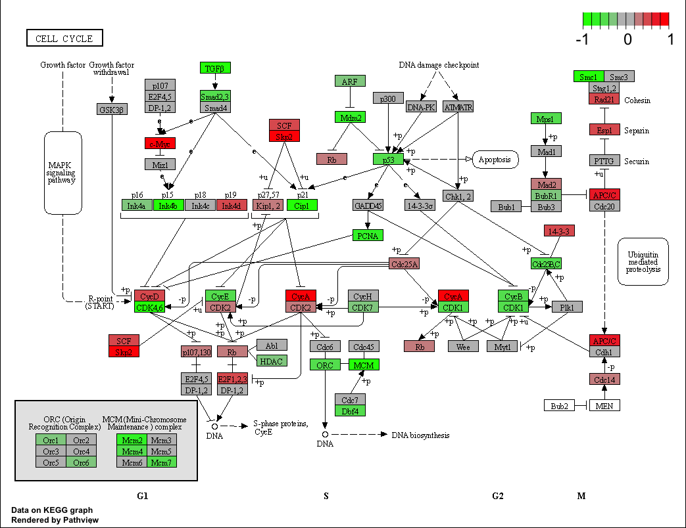
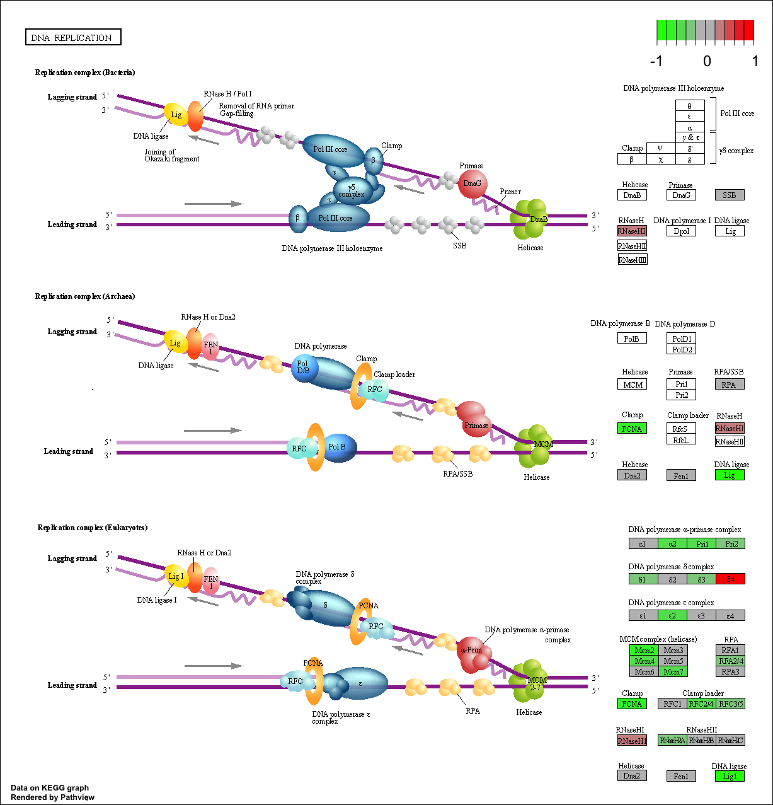

# Background
Our data for today come from Himes et al. RNASeq analysis of the drug dexamethasone, a synthetic glucocorticoid steroid with anti-inflammatory effects (Himes et al. 2014). 

# 2. Import countData and colData

```{r}
counts <- read.csv("airway_scaledcounts.csv", row.names=1)
metadata <-  read.csv("airway_metadata.csv")
```

Let's have a look at these
```{r}
head(counts)
head(metadata)
```

```{r}
nrow(counts)
sum(metadata$dex == "control")
```

> Q1. How many genes are in this dataset?

There are 38694 genes in this dataset.

> Q2. How many ‘control’ cell lines do we have?

There are 4 'control' cell lines. 


# 3. Toy Differential Gene Expression

```{r}
control <- metadata[metadata[,"dex"]=="control",]
control.counts <- counts[ ,control$id]
control.mean <- rowSums( control.counts )/4 
head(control.mean)
```

```{r}
library(dplyr)
control <- metadata %>% filter(dex=="control")
control.counts <- counts %>% select(control$id) 
control.mean <- rowSums(control.counts)/4
head(control.mean)
```

> Q3. How would you make the above code in either approach more robust?

First I need to extract all the "control" columns. Then I'll take the row-wise mean to get the average count values for all genes in these 4 experiments.
```{r}
control.inds <- metadata$dex == "control"
control.counts <- counts[ , control.inds]
head(control.counts)
control.mean <- rowMeans(control.counts)
head(control.mean)
```

> Q4. Follow the same procedure for the treated samples (i.e. calculate the mean per gene across drug treated samples and assign to a labeled vector called treated.mean)

```{r}
treated.inds <- metadata$dex == "treated"
treated.counts <- counts[ , treated.inds]
head(treated.counts)
treated.mean <- rowMeans(treated.counts)
head(treated.mean)
```

We will combine our meancount data for bookkeeping purposes.
```{r}
meancounts <- data.frame(control.mean, treated.mean)
colSums(meancounts)
```

> Q5 (a). Create a scatter plot showing the mean of the treated samples against the mean of the control samples. Your plot should look something like the following.

```{r}
plot(meancounts[,1],meancounts[,2], xlab="Control", ylab="Treated")
```

> Q5 (b).You could also use the ggplot2 package to make this figure producing the plot below. What geom_?() function would you use for this plot?

```{r}
library(ggplot2)
ggplot(meancounts) + 
  aes(x=control.mean, y=treated.mean) + 
  geom_point()
```

This indicates that we need a log transformation to see details of our data

> Q6. Try plotting both axes on a log scale. What is the argument to plot() that allows you to do this? 

```{r}
plot(meancounts, log="xy")
```
We often use log2 in this field because it has nice math properties that make interpretation easier. 

We see 0 values for no change and + values for increases and minus values for decreases. This nice property leads us to work with **log2(fold-change)** all the time in the genomics and proteomics field.
```{r}
log2(1)
log2(20/10)
log2(5/10)
```

Let's add the **log2(fold-change)** values to our `meancounts` dataframe. 
```{r}
meancounts$log2fc <- log2(meancounts[,"treated.mean"]/meancounts[,"control.mean"])
head(meancounts)
```

I need to exclude the genes (i.e. rows) with zero counts because we can't say anything about these as we have no data for them. I can use the **which()** function with the `arr.ind=TRUE` argument to get the columns and rows where the TRUE values are (i.e. the zero counts in our case). 
```{r}
zero.vals <- which(meancounts[,1:2]==0, arr.ind=TRUE)
head(zero.vals)
to.rm <- unique(zero.vals[, "row"])
head(sort(to.rm))
```

Now remove these from our `meancounts` dataframe.

```{r}
mycounts <- meancounts[-to.rm,]
head(mycounts)
# How many do we have left?
nrow(mycounts)
```

> Q7. What is the purpose of the arr.ind argument in the which() function call above? Why would we then take the first column of the output and need to call the unique() function?

The arr.ind argument will indicate which rows/columns are true. In this case, if it's true, it means that the rows, or genes, and columns, or samples, have zero counts. Since there are two columns, control.mean and treated.mean, that can have zero values, we need to use the unique() function in order to only count a row once even if it has zero values for both the samples. 

How many genes are up regulated upon drug treatment? We will use a log2 threshold of +2 for this.

```{r}
sum(mycounts$log2fc > 2)
```

How many genes are down regulated at the -2 fold change threshold?

```{r}
sum(mycounts$log2fc < -2)
```

```{r}
up.ind <- mycounts$log2fc > 2
down.ind <- mycounts$log2fc < (-2)
sum(up.ind)
sum(down.ind)
```

> Q8. Using the up.ind vector above can you determine how many up regulated genes we have at the greater than 2 fc level?

250 genes are up regulated.

> Q9. Using the down.ind vector above can you determine how many down regulated genes we have at the greater than 2 fc level?

367 genes are down regulated.

> Q10. Do you trust these results? Why or why not?

No, not necessarily since we haven't analyzed the p-values. Analyzing the p-values will allow us to know if the results are statistically significant, but just know which genes are up regulated or down regulated based on a threshold won't tell us if the results are actually in fact statistically significant. 


# 4. DESeq2 Analysis

```{r}
library(DESeq2)
citation("DESeq2")
```

We need to first setup the input object for DESeq
```{r}
dds <- DESeqDataSetFromMatrix(countData=counts, 
                              colData=metadata, 
                              design=~dex)
dds
```

Now we can run DESeq analysis
```{r}
dds <- DESeq(dds)
```

To get at the results, we use the deseq `results()` function
```{r}
res <- results(dds)
head(res)
```

```{r}
summary(res)
```

Focus in on genes with a small p-value (i.e. show a significant change)
```{r}
res05 <- results(dds, alpha=0.05)
summary(res05)
```


# 5. Adding Annotation Data

```{r}
library("AnnotationDbi")
library("org.Hs.eg.db")
```

Let's have a look at what is in the `org.Hs.eg.db` 

```{r}
columns(org.Hs.eg.db)
```

We will use the `mapIDs` function to translate between identifiers from different databases. 

```{r}
res$symbol <- mapIds(org.Hs.eg.db,
                     keys=row.names(res),
                     keytype="ENSEMBL",
                     column="SYMBOL",
                     multiVals="first")
```

```{r}
head(res)
```

> Q11. Run the mapIds() function two more times to add the Entrez ID and UniProt accession and GENENAME as new columns called res$entrez, res$uniprot and res$genename.

We need ENTREZ ids for pathway analysis with KEGG
```{r}
res$entrez <- mapIds(org.Hs.eg.db,
                     keys=row.names(res),
                     column="ENTREZID",
                     keytype="ENSEMBL",
                     multiVals="first")

res$uniprot <- mapIds(org.Hs.eg.db,
                     keys=row.names(res),
                     column="UNIPROT",
                     keytype="ENSEMBL",
                     multiVals="first")

res$genename <- mapIds(org.Hs.eg.db,
                     keys=row.names(res),
                     column="GENENAME",
                     keytype="ENSEMBL",
                     multiVals="first")

head(res)
```

```{r}
ord <- order( res$padj )
#View(res[ord,])
head(res[ord,])
```

```{r}
write.csv(res[ord,], "deseq_results.csv")
```


# Save our results

Write out whole results dataset (including genes that don't change significantly)

```{r}
write.csv(res, file="allmyresults.csv")
```


# 6. Data Visualization

Let's make a commonly produced visualization from this data, namely a so-called volcano plot. These summary figures are frequently used to highlight the proportion of genes that are both significantly regulated and display a high fold change. 

```{r}
plot( res$log2FoldChange,  -log(res$padj), 
      xlab="Log2(FoldChange)",
      ylab="-Log(P-value)")
```

```{r}
plot( res$log2FoldChange,  -log(res$padj), 
 ylab="-Log(P-value)", xlab="Log2(FoldChange)")

# Add some cut-off lines
abline(v=c(-2,2), col="darkgray", lty=2)
abline(h=-log(0.05), col="darkgray", lty=2)
```

Let's add some color to this plot to draw attention to the genes (i.e. points) we care about - that is those with large fold-change and low p-values (i.e. high -log(p-values)).
```{r}
# Setup our custom point color vector 
mycols <- rep("gray", nrow(res))
mycols[ abs(res$log2FoldChange) > 2 ]  <- "red" 

inds <- (res$padj < 0.01) & (abs(res$log2FoldChange) > 2 )
mycols[ inds ] <- "blue"

# Volcano plot with custom colors 
plot( res$log2FoldChange,  -log(res$padj), 
 col=mycols, ylab="-Log(P-value)", xlab="Log2(FoldChange)" )

# Cut-off lines
abline(v=c(-2,2), col="gray", lty=2)
abline(h=-log(0.1), col="gray", lty=2)
abline(h=-log(0.1), col="gray", lty=2)
```

Let's make another volcano plot with some gene labels. For this, we can use the **EnhancedVolcano** package 
```{r}
library(EnhancedVolcano)
```

```{r}
x <- as.data.frame(res)

EnhancedVolcano(x,
    lab = x$symbol,
    x = 'log2FoldChange',
    y = 'pvalue')
```


# 7. Pathway Analysis

```{r}
library(pathview)
library(gage)
library(gageData)

data(kegg.sets.hs)

# Examine the first 2 pathways in this kegg set for humans
head(kegg.sets.hs, 2)
```

The main **gage()** function requires a named vector of fold changes, where the names of the values are the Entrez gene IDs.
```{r}
foldchanges = res$log2FoldChange
names(foldchanges) = res$entrez
head(foldchanges)
```

```{r}
# Get the results
keggres = gage(foldchanges, gsets=kegg.sets.hs)
```

This separates out results by "greater" and "less" i.e. those that are up regulated and those that are down regulated
```{r}
attributes(keggres)
```

```{r}
# Look at the first three down (less) pathways
head(keggres$less, 3)
```

```{r}
pathview(gene.data=foldchanges, pathway.id="hsa05310")
```


```{r}
# A different PDF based output of the same data
pathview(gene.data=foldchanges, pathway.id="hsa05310", kegg.native=FALSE)
```

> Q12. Can you do the same procedure as above to plot the pathview figures for the top 2 down-regulated pathways?

```{r}
pathview(gene.data=foldchanges, pathway.id="hsa04110")
```


```{r}
pathview(gene.data=foldchanges, pathway.id="hsa03030")
```



